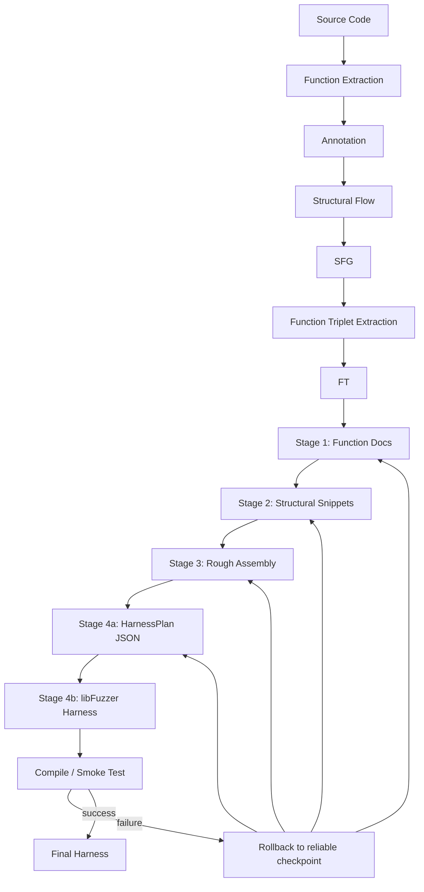

# Harness Pipeline

本文档描述当前仓库中从 C 源码到可验证 libFuzzer harness 的 artifact-first
流程。Phase 1 的 SFG 构建与后续 harness generation 保持解耦；后续阶段读取已有
JSON artifact，不会重新实现或绕过 SFG pipeline。

## 总体流程



即：

```text
Source Code -> Function Extraction -> Annotation -> Structural Flow -> SFG
-> Function Triplet Extraction -> FT -> Stage 1 -> Stage 2 -> Stage 3
-> HarnessPlan -> Stage 4 -> Compile/Smoke Test -> Rollback if needed
```

上游 `sfg_builder` 生成 `functions.json`、`candidates.json`、
`annotations.json`、`flows.json`、`sfg.json`、`sfg.dot`、`ownership.json`
和 `usage_patterns.json`。下游
`harness_generation` 将这些 artifact 适配为稳定的多重有向图，生成
`triplets.json`，再围绕单个 FT 逐阶段生成代码。

## 核心术语

- **ISF（Input Stream Function）**：将 fuzz byte stream 接入目标库的入口函数。
  一个函数可以同时具有 ISF 和其他角色。
- **PRF（Process Function）**：沿结构数据流处理、转换或消费内部结构的函数。
- **HPF（Helper Function）**：初始化、释放或辅助生命周期管理等函数。若同一函数
  同时是 PRF 和 HPF，FT 分类时按 PRF 优先。
- **SFG（Structural Flow Graph）**：以唯一 struct type 和特殊空节点
  `"(null)"` 为节点、以函数对应的结构转换为边的多重有向图。平行边不会被覆盖。
- **FT（Function Triplet）**：`FT = (I, P, H)`。`I` 是唯一 ISF，`P` 是零个
  或多个 PRF，`H` 是零个或多个 HPF。FT 还保留函数身份、structures、edges 和
  data-chain metadata。
- **Bypass semantics（旁路语义）**：FT 上的非 SFG sidecar 证据，来自
  `functions.json` 中的参数、return type、access hints 和函数 body AST hints。
  它表达 byte-stream/length 绑定、scalar 参数、guard condition、constant reference、
  return status 和 struct access 等结构边之外的信息；不会新增、删除或重写 SFG 节点/边。
- **Processing unit**：Stage 2 按相同
  `(input_structure, output_structure)` 聚合的局部结构转换单元。一个 unit 可以包含多个平行边函数，
  并保存对其他 unit 的依赖。
- **Checkpoint**：某 stage 成功执行、验证并持久化后的可靠输出。checkpoint 用于
  resume 和失败后的分层重新生成。
- **Rollback**：某 stage 失败时，由集中式策略选择最近可靠 checkpoint 并重新开始；
  它不是删除上游 SFG，也不是修改目标项目源码。
- **HarnessPlan**：Stage 4 内部的严格 JSON 计划，描述 state objects、fuzzer
  input 解码、FT 调用顺序、data/size 绑定、约束和 cleanup。它不是最终 harness
  源码，也不允许携带 `LLVMFuzzerTestOneInput` 的完整 C 实现。

## 为什么 one ISF usage variant -> one FT -> one harness

ISF 是外部 fuzz input 进入结构数据流的语义边界。不同 ISF 即使汇入相同结构，
其参数约束、初始化方法和生命周期也可能完全不同。把多个 ISF 合并进一个 FT 会让
Stage 4 无法确定唯一 external-input entry，也会让生成结果难以归因和复现。

因此提取器以每个唯一 ISF 为 anchor，屏蔽其他 ISF 对可达性遍历的入口影响，再为
当前 anchor 收集相关 PRF、HPF 和结构边。如果项目内 usage mining 发现多个合法的
producer/consumer/cleanup 序列，则每个序列生成独立 FT variant。每个 FT 最终只生成
一个 harness，使关系
保持为：

```text
one ISF anchor + one usage pattern -> one isolated FunctionTriplet -> one auditable harness
```

multi-role 不破坏这一约束：当前 anchor 可以同时是 HPF/PRF；“唯一”只表示 FT 中
只有一个函数承担 external-input ISF anchor。

## Function Triplet Extraction

实现入口：

- `harness_generation/sfg_adapter.py`：加载真实 Phase 1 JSON、校验交叉引用、
  规范化 null node，并提供 deterministic ancestor/descendant traversal。
- `harness_generation/triplet_extractor.py`：执行 role-aware 子图提取。
- `harness_generation/triplet.py`：FT model、稳定排序和 JSON 序列化。
- `harness_generation/triplet_cli.py`：提取、inspection 和统计 CLI。

对每个按 `function_id` 排序的 ISF，提取器执行：

1. 建立 role-aware graph view。其他 ISF 边不参与 traversal；如果该函数还有
   PRF/HPF 标签，只在其两个端点已进入当前子图时保留非 ISF 语义。
2. 从 anchor edge 的 input structures 计算 ancestors，从 output structures 计算
   descendants，并取节点并集诱导出的边。
3. 收集边上的 PRF 和 HPF；PRF+HPF 按 PRF 分类优先，同时完整 roles 仍保存在
   function/edge record 中。
4. 保留 parallel edges；cycle traversal 使用 visited set，输出按稳定 key 排序。
5. 使用 `relative source path + function name + normalized signature` 的 SHA-256
   短摘要生成 `ft_<sanitized-isf-name>_<12-hex>`。ID 不依赖排序位置、Python
   `hash()` 或机器绝对路径；插入其他 ISF 不会改变已有 FT identity。
6. 在 FT sidecar 上附加 bypass semantics。该步骤只读取 `functions.json` 的函数
   metadata，不修改 `sfg.json`，也不改变 ancestor/descendant traversal 的结果。
7. 读取 `usage_patterns.json`。同一 ISF 的不同 producer、调用序列、cleanup 条件或
   生命周期类型分别生成稳定 variant ID；支持度和证据位置写入 FT ownership relation。
8. LLM semantic analyzer 对静态候选做受约束复核：判断 lifecycle 是否成立、区分
   required/optional calls，并为等价模式分组。它不能新增 API、修改参数位置或跨变量
   合并；prompt/response/confidence 全部写入 `usage_patterns.json`。安全等价组汇总
   support 后生成一个 FT，其他模式仍分别生成。

null 表示由独立 adapter 统一识别，包括 `null`、`NULL`、`(null)`、
`**NULL**`、`None` 等变体，并规范为当前 canonical `"(null)"`。Traversal 可以
访问并保留指向/来自 null 的语义边，但访问 sentinel 后立即停止扩展。因而
`Parser -> NULL <- Image` 不会把 Parser 与 Image 连接成同一 structural dataflow。

## Stage 1-4

四个 Stage 都是真实实现，不是空接口；测试通过注入 `MockLLM` 运行，不依赖网络。

| Stage | 输入 | 行为 | 主要输出 |
| --- | --- | --- | --- |
| Stage 1 | FT、相关 `functions.json` records、相关函数真实源码 | 为 FT 内每个函数生成严格 JSON 文档；不会发送整个项目源码 | `stage1_docs.json`、`raw/stage1_*.txt` |
| Stage 2 | FT、Stage 1 docs、structural edges | 建立 processing units，为每个局部结构转换生成 snippet；同端点函数不会丢失 | `stage2_snippets.json`、`snippets/unit_*.c`、Stage 2 prompts/raw |
| Stage 3 | snippets、依赖、函数 metadata、FT structures | 由 LLM 做 dependency-aware rough assembly，并用 tree-sitter 审计调用 | `stage3_rough.c`、`stage3_metadata.json`、`stage3/attempt_NNN/` |
| Stage 4 | rough code、唯一 ISF、函数 metadata、HarnessPlan | 先生成并校验严格 JSON `HarnessPlan`，再按 plan 转换为 C++ `LLVMFuzzerTestOneInput`，检查 data/size 接入、目标 API、cleanup 和禁用 I/O/logging | `stage4_harness_plan.json`、`stage4_harness.c`、`harnesses/<ft_id>.c`、`stage4/attempt_NNN/` |

Stage 4 被刻意拆成 plan 与 code 两次 LLM invocation。第一次只能返回 JSON 计划，
必须覆盖 FT 全部函数，唯一 ISF 必须绑定 `data` 和 `size`，PRF+HPF 函数按
processing call 处理，纯 HPF cleanup 放入 cleanup sequence。只有 plan 校验通过后，
第二次 invocation 才能按该 plan 生成 C harness。这样后续 feedback 可以修改 plan
层面的输入 grammar、状态模型或 cleanup 策略，而不是直接要求模型重写整段 C。
HarnessPlan prompt 会看到 FT bypass semantics，因此可利用 scalar length、magic/constant
guard、return status 和 access hints 等旁路证据来设计输入修复与调用策略。

Stage 类只依赖统一 `LLMClient.generate`。当前 provider 支持 deterministic
`MockLLM`、recorded response 和 OpenAI-compatible endpoint；API key 只从配置指定的
环境变量读取，不写入仓库。Prompt 定义集中在 `harness_generation/prompts.py`，具有
name/version 和可保存的参数化渲染结果。

## Validation、compile、smoke 与 rollback

`IntermediateValidator` 使用 tree-sitter C AST 检查 expected/missing/unexpected
调用、重复或目标函数定义、明显 C++ syntax、禁用 I/O/logging，以及未知目标 API，
输出统一的 `ValidationResult {success, errors, warnings, metadata}`。

`CompilerValidator` 和 `BuildAdapter` 支持 include paths、library paths、compiler
flags、link flags 和自定义 build command。没有链接配置时仍可执行真实
`clang -fsyntax-only`，并明确记录：

```json
{
  "syntax_valid": true,
  "link_validation": "unavailable"
}
```

`RuntimeValidator` 在 executable 可用时用 empty/minimal input 执行有明确 timeout 的
fixed-input smoke；不可用时返回 `status="skipped"` 和 reason，不伪造成功。随后只有
intermediate、compile、link、runtime 均被 policy 接受，才会进入 30--120 秒（默认
60 秒）的 libFuzzer smoke。

Validator artifact 相互隔离：

```text
generation/<ft_id>/validation/
├── intermediate.json
├── compiler.json
├── linker.json
├── runtime.json
└── summary.json
```

每个结果包含 `validator`、`status`、`errors`、`warnings` 和 `metadata`；compiler
与 runtime 另外保留 command、return code、stdout/stderr 和 timeout 等诊断。
`summary.json` 的 overall 规则是：任一 `failed` 则 `failed`；全部已运行检查均
`passed` 则 `passed`；至少一个 `passed` 且存在 `skipped/unavailable` 则
`passed_with_limitations`；没有通过项但只有限制状态则 `unavailable`。因此缺少链接
配置或 executable 不会被伪造成失败或成功。

`PipelineStageValidator` 已正式接入 orchestrator。每个 Stage 按 `run -> persist ->
validate -> checkpoint` 执行；Stage 4 依次调用 intermediate、target/harness compile、
link、runtime smoke 和可选 fuzz smoke。Artifact 存在不再等价于验证通过；validator
返回的统一 `ValidationResult` 会直接参与 orchestrator 的 accept/rollback 决策。
失败上下文只保留 bounded error summary、validator、failure type 和 stderr tail，完整
stdout/stderr 则保存在 artifact 中。

所有 stage 通过统一 orchestrator 的 `input -> run -> validate -> persist ->
checkpoint` 生命周期执行。状态写入：

```text
artifacts/<project>/generation/<ft_id>/pipeline_state.json
```

Stage 4 失败时，策略先保留 Stage 3 checkpoint 并重新生成 Stage 4；每层最多重试
`max_regen_per_level=3` 次，之后依次回退到 Stage 2、Stage 1，最后回到 root input。
`rollback_level` 表示保留的 checkpoint：

- `3`：保留 Stage 1-3，重新生成 Stage 4；
- `2`：保留 Stage 1-2，重新生成 Stage 3 及以后；
- `1`：保留 Stage 1，重新生成 Stage 2 及以后；
- `0`：从 root input 重新生成 Stage 1 及以后。

这是为解决 SynapseFlow Phase 文字描述与 Algorithm 2 初始回滚目标不一致而采用的
工程选择。rollback 集中在 `StagedRollbackStrategy`，没有散落到各 Stage。

## Artifact 布局

```text
artifacts/<project>/
├── functions.json
├── candidates.json
├── annotations.json
├── flows.json
├── sfg.json
├── sfg.dot
├── ownership.json
├── usage_patterns.json
├── triplets.json
├── ft_selection.json
├── triplets/
├── generation/
│   └── <ft_id>/
│       ├── stage1/
│       │   ├── stage1_docs.json
│       │   ├── prompts/
│       │   └── raw/
│       ├── stage2/
│       │   ├── stage2_snippets.json
│       │   ├── prompts/
│       │   ├── raw/
│       │   └── snippets/
│       ├── stage1_docs.json
│       ├── stage2_snippets.json
│       ├── stage3_rough.c
│       ├── stage3_metadata.json
│       ├── stage4_harness_plan.json
│       ├── stage4_harness.c
│       ├── pipeline_state.json
│       ├── pipeline_result.json
│       ├── prompts/
│       ├── raw/
│       ├── snippets/
│       ├── stage3/
│       │   └── attempt_NNN/
│       │       ├── prompt.txt
│       │       ├── response.txt
│       │       ├── parsed.json
│       │       ├── rough.c
│       │       └── metadata.json
│       ├── stage4/
│       │   └── attempt_NNN/
│       │       ├── plan_prompt.txt
│       │       ├── plan_response.txt
│       │       ├── plan.json
│       │       ├── prompt.txt
│       │       ├── response.txt
│       │       ├── parsed.json
│       │       ├── outcome.json
│       │       ├── harness.c
│       │       └── metadata.json
│       └── validation/
│           ├── intermediate.json
│           ├── compiler.json
│           ├── linker.json
│           ├── runtime.json
│           └── summary.json
├── harnesses/
│   └── <ft_id>.c
├── build/
│   └── <ft_id>/
│       ├── objects/
│       ├── libsimple_target.a
│       ├── compile_commands.json
│       ├── build.json
│       └── fuzzer
└── fuzz/
    └── <ft_id>/
        └── smoke_NNN/
            ├── command.txt
            ├── stdout.txt
            ├── stderr.txt
            ├── final_stats.json
            ├── metadata.json
            ├── corpus/
            └── crashes/
```

`triplets.json` 是 canonical FT output；当前 schema v5 包含 bypass semantics、ownership
relations 和 usage-lifecycle evidence，并继续读取 schema v1-v4。`triplets/<ft_id>.json`
是通过 `--individual` 请求的可选 inspection artifact。所有新增目录都叠加在 Phase 1
输出之上，不覆盖 SFG pipeline 的源 artifact。

## CLI

从已有 Phase 1 artifacts 提取 FT，不需要 LLM key：

```bash
python -m harness_generation triplets --artifacts artifacts/simple
python -m harness_generation triplets show \
  --artifacts artifacts/simple --id ft_parser_from_memory_a5265df23ba0
```

对较大项目先按证据、结构收益和基线 LLM 成本筛选 FT：

```bash
python -m harness_generation triplets rank \
  --artifacts artifacts/project --min-score 0.55 \
  --max-ft 20 --max-calls 300

python -m harness_generation generate-all \
  --artifacts artifacts/project \
  --selection artifacts/project/ft_selection.json \
  --provider openai-compatible
```

`ft_selection.json` 保留完整排名、逐项证据、排除原因、预算和最终选择顺序。评分
定义与大型项目迭代流程见 [FT_SELECTION.md](FT_SELECTION.md)。
opaque handle 的类型恢复、生命周期闭包及 FT authority 分级见
[FT_AUTHORITY.md](FT_AUTHORITY.md)。

使用 offline Mock response 文件生成单个 FT：

```bash
python -m harness_generation generate \
  --artifacts artifacts/simple \
  --ft ft_parser_from_memory_a5265df23ba0 \
  --mock-responses path/to/responses.json
```

其他生成控制：

```bash
python -m harness_generation generate-all \
  --artifacts artifacts/simple \
  --mock-responses path/to/responses.json

python -m harness_generation generate \
  --artifacts artifacts/simple --ft ft_parser_from_memory_a5265df23ba0 \
  --until-stage 2 --mock-responses path/to/responses.json

python -m harness_generation generate \
  --artifacts artifacts/simple --ft ft_parser_from_memory_a5265df23ba0 \
  --resume --mock-responses path/to/remaining-responses.json
```

Mock response 数量和顺序必须与所选 FT 的函数数、processing unit 数及执行到的
Stage 一致。单元测试通常直接注入 `MockLLM`，更适合构造确定性响应。

同一 CLI 的 `run` 子命令提供三层能力：

```bash
# 只生成 Stage 1--4
python -m harness_generation run --artifacts artifacts/simple --ft <ft_id>

# 生成并执行 Stage/intermediate validation，不 build
python -m harness_generation run --artifacts artifacts/simple --ft <ft_id> --validate

# 完整 E2E：真实 provider、build/link/runtime 和短时 fuzz
python -m harness_generation run \
  --artifacts artifacts/simple \
  --ft ft_parser_from_memory_a5265df23ba0 \
  --real-llm --build --smoke-fuzz --fuzz-seconds 60
```

## 测试与当前 simple 验收基线

运行完整测试：

```bash
python -m pytest -q
```

只运行 offline 端到端验收：

```bash
python -m pytest -q tests/test_mock_pipeline_e2e.py
```

当前 `artifacts/simple` 重新提取结果：

```text
Unique functions: 4
Role memberships:
  ISF: 1
  PRF: 2
  HPF: 2
Multi-role functions: 1
FTs: 1
Average functions per FT: 4.00
Max FT size: 4

ft_parser_from_memory_a5265df23ba0
  ISF: parser_from_memory                 (null) -> Parser
  PRF: parser_next                        Parser -> Node
  PRF: node_process                       Node -> (null)
  HPF: parser_from_memory [ISF + HPF]     (null) -> Parser
  HPF: parser_free                        Parser -> (null)
  data chain: fuzz_input -> Parser -> Node
```

端到端测试从这些 Phase 1 artifacts 重新生成 `triplets.json`，按 ISF 选取该 FT，
用 11 个固定 Mock responses 跑完 Stage 1-4，其中 Stage 4 包含 HarnessPlan JSON
和最终 C harness 两次响应。simple target 的 `src/parser.c`、
`include/parser.h`、include path 和 flags 已由 `TargetBuildConfig` 明确建模；当 capability
probe 确认 clang、ar、libFuzzer、ASan、UBSan 可用时，测试会执行真实 compile/link，
否则以明确原因 skip。普通测试不会访问真实 LLM 网络。

## Schema、兼容性与已知限制

- 新写入的 `functions.json` 使用 schema v3：函数 `file` 始终相对于 target project
  root，`project` 是相对于 artifact directory 的 locator，并带有
  `source_path_base="project"`；同时可包含 `opaque_handles` 及 opaque handle 生命周期字段。
  `SourcePathResolver` 同时支持 v1/v2/v3；移动 artifact 而不保留其相对目录关系时，可用
  generation CLI 的 `--project-root` 显式覆盖。
- 新写入的 `triplets.json` 使用 schema v5 和内容寻址 FT ID；loader 继续接受 schema v1-v4。
  旧 `ft_0001` 目录不会自动删除或迁移。重新提取后应使用 canonical `triplets.json` 中的
  新 ID；旧 pipeline state 仍保留供人工审计。
- simple 的 `parser_from_memory` 同时标为 ISF 和 HPF。这是合法 multi-role，但会让
  HPF 统计包含 ISF anchor；消费者不能假设角色计数互斥。
- Stage 3/4 的每次 LLM invocation 在校验前即保存独立 attempt。Stage 4 attempt
  额外保存 plan prompt、raw plan response 和 `plan.json`。失败 attempt 不会被后续
  retry 覆盖；canonical `stage3_rough.c`、`stage4_harness_plan.json`、
  `stage4_harness.c` 只在校验通过后更新。Metadata 保存 stage、attempt、FT、prompt version、model/provider、UTC
  timestamp，以及可获得时的 temperature、max tokens、rollback source/retry reason，
  从不保存 API key。
- Stage 4 的 `parsed.json` 只记录 plan/code 解析结果。每个 attempt 的
  `outcome.json` 汇总最终状态、失败阶段与类型，并指向同目录的
  `validation/*.json`。单独运行 Stage 4 时状态为 `pending_validation`；流水线
  验证结束后更新。统计 attempt 失败类型应读取 `outcome.json`，不能只读
  `parsed.json`。
- 当前真实 LLM provider 是 OpenAI-compatible endpoint。没有同时配置
  `LLM_BASE_URL`、`LLM_API_KEY`、`LLM_MODEL` 时会在 Stage 1 前明确失败，不会静默
  fallback 到 Mock。
- Mock 验收用于确定性回归；2026-09-14 又使用 DeepSeek 官方 OpenAI-compatible API
  完成了一次独立真实验收。DeepSeek V4 默认 thinking 会消耗生成 token，因此代码生成
  验收使用 `LLM_THINKING=disabled`；该选项是可选 provider 配置，不影响其他 endpoint。
- Runtime/fuzz 的 source-frame attribution 依赖 sanitizer 输出包含可解析的源码路径；
  无法归因的 crash 会保留原始 stderr 并明确标记，而不会自动分类漏洞。

本流程只在显式 `--smoke-fuzz` 或配置启用时运行 30--120 秒的 bounded smoke；不实现
coverage feedback、长期 fuzzing 或 exploit，也不会执行 git push。

## E2E Closure 最终验收（更新于 2026-09-14）

以下状态词具有严格含义：

- **IMPLEMENTED**：代码路径已实现。
- **VERIFIED WITH MOCK**：Stage 1--4 使用 `MockLLM`，不代表真实模型成功。
- **VERIFIED WITH REAL COMPILER**：实际执行 clang/ar 并检查 return code/artifact。
- **VERIFIED WITH REAL LIBFUZZER**：实际启动生成的 libFuzzer executable。
- **VERIFIED WITH REAL LLM**：完成真实 provider 网络调用并由后续 validator 验证输出。
- **BLOCKED BY ENVIRONMENT**：所需外部配置缺失；本次最终验收不属于此状态。

### 1. 修改文件

E2E closure 的实现集中在：

- Pipeline/CLI：`harness_generation/orchestrator.py`、`pipeline_validation.py`、
  `pipeline_result.py`、`generation_cli.py`、`cli.py`。
- Validation/build/runtime/fuzz：`validation.py`、`compiler_validation.py`、
  `target_build.py`、`fuzzer_build.py`、`runtime_validation.py`、`fuzz_smoke.py`。
- Generation/provider/persistence：`artifacts.py`、`llm.py`、`prompts.py`、
  `source_paths.py`、`source_analysis.py`、`generation_context.py`、
  `generation_output.py`、`stage1.py`、`stage2.py`、`stage3.py`、`stage4.py`、`__init__.py`。
- Tests：`test_validator_rollback_integration.py`、`test_fuzzer_build.py`、
  `test_runtime_validation.py`、`test_fuzz_smoke.py`、`test_artifacts.py`、
  `test_mock_pipeline_e2e.py`、`test_generation_cli.py`、`test_generation_output.py`、
  `toolchain_probe.py`，以及为统一
  capability skip 更新的 `test_fuzz.py`、`test_pipeline.py`、`test_assessment.py`。
- 文档：本文件。手工验收还生成了 `artifacts/simple/generation/`、`build/`、`fuzz/`
  和 `harnesses/` 下的可审计输出。

Phase 1 的 `sfg_builder` 和 FT extraction 没有在 E2E closure 中重设计。工作树还包含
早于本验收、未归因给本轮的其他修改/删除；验收没有 reset、删除或 push 它们。

### 2. 原 orchestrator 为什么不能由 validator 触发 rollback

原先 Stage handler 的 validation 主要确认生成结果/文件存在，compiler、linker、runtime
作为可独立调用组件，其真实失败没有返回给 `PipelineOrchestrator.run()`，所以
orchestrator 看不到 failed `ValidationResult`，也就无法调用 rollback policy。

### 3. 当前 validation -> rollback 连接方式

现在连接为：`Stage generation -> persist -> PipelineStageValidator -> ValidationResult ->
validation.accepted -> StagedRollbackStrategy.after_failure()`。失败事件记录
`failed_stage`、`validator`、`failure_type`、`attempt`、`rollback_target`、`reason`；Stage 4
首先在最近 Stage 3 checkpoint 重生，达到阈值后依次回滚 Stage 3、Stage 2、Stage 1。

### 4. simple target build/link command

本次真实执行的关键命令（绝对路径缩写为 `$ROOT` 和 `$BUILD`）是：

```bash
clang -std=c11 -g -O1 -Werror=implicit-function-declaration \
  -fsanitize=fuzzer-no-link,address,undefined \
  -I$ROOT/tests/fixtures/simple_project/include \
  -c $ROOT/tests/fixtures/simple_project/src/parser.c \
  -o $BUILD/objects/src/parser.o

ar rcs $BUILD/libsimple_target.a $BUILD/objects/src/parser.o

clang -std=c11 -g -O1 -Werror=implicit-function-declaration \
  -fsanitize=fuzzer-no-link,address,undefined \
  -I$ROOT/tests/fixtures/simple_project/include \
  -c $ROOT/artifacts/deepseek_real/generation/ft_parser_from_memory_a5265df23ba0/stage4_harness.c \
  -o $BUILD/objects/harness.o

clang $BUILD/objects/src/parser.o $BUILD/objects/harness.o \
  -g -O1 -fsanitize=fuzzer,address,undefined -o $BUILD/fuzzer
```

其中 `$ROOT=/home/luchitong/work/harness_generation`，
`$BUILD=$ROOT/artifacts/deepseek_real/build/ft_parser_from_memory_a5265df23ba0`。

### 5. 最终 fuzzer executable

`artifacts/deepseek_real/build/ft_parser_from_memory_a5265df23ba0/fuzzer`。

### 6. Controlled failure

**VERIFIED WITH REAL COMPILER**：确定性集成测试的 attempt 1 使用宏把允许的 `abort()`
展开为未声明 `undefined_function()`；AST intermediate 通过，但 clang compile 返回非零，
记录 `validator=compiler`、`failure_type=compile_error`。策略回滚目标为
`STAGE_4_HARNESS`（保留 Stage 3 checkpoint）。attempt 2 使用合法 harness，重新经过
compiler/linker/runtime 后成功，pipeline 最终 completed。该测试没有 mock
`ValidationResult`。

### 7. Real LLM

- **VERIFIED WITH REAL LLM**：使用 DeepSeek 官方 OpenAI-compatible endpoint，配置
  `LLM_BASE_URL=https://api.deepseek.com`、请求模型 `deepseek-v4-flash`、
  `LLM_THINKING=disabled`。服务响应的 model 字段为 `deepseek-flash`。Stage 1--4 均发生
  真实网络调用；raw response/metadata 已保存，API key 未写入 artifact。
- 第一轮真实测试暴露签名字节级比较问题；现改为 tree-sitter token 等价比较，仍拒绝
  qualifier、类型、参数等语义变化，最终签名始终取自 `functions.json`。
- Stage 2--4 接受仅包裹整个响应的单层 C Markdown fence，raw response 原样保留；剥离
  后仍执行 AST、API、compiler、linker 和 runtime 全部检查。

### 8. Stage 1--4 状态

- **VERIFIED WITH REAL LLM**：`ft_parser_from_memory_a5265df23ba0` 的 Stage 1、2、3、4
  均为 `passed`；metadata 记录 `provider=openai-compatible` 及各 prompt version。
- **VERIFIED WITH MOCK**：原有离线回归仍保留且通过，没有被真实网络测试替代。

### 9. Compiler / Linker / Runtime 状态

- **VERIFIED WITH REAL COMPILER**：Intermediate、Compiler、Linker、Runtime 均为
  `passed`；compiler/linker return code 均为 0，runtime 的 empty/minimal inputs 均通过。

### 10. fuzz smoke

- **VERIFIED WITH REAL LIBFUZZER**：实际运行 30 秒（wall timeout 45 秒），
  `execs_done=41586639`、`execs_per_sec=1341504`、`cov=14`、`ft=15`、`corp=1`、
  `crashes=0`、`ooms=0`、`timeouts=0`。libFuzzer 初始化和 final stats 均已观察到。

### 11. Artifact 路径

- 总结果：`artifacts/deepseek_real/generation/ft_parser_from_memory_a5265df23ba0/pipeline_result.json`
- Pipeline history：`artifacts/deepseek_real/generation/ft_parser_from_memory_a5265df23ba0/pipeline_state.json`
- Stage 1--4：同目录的 `stage1/`、`stage2/`、`stage3/attempt_001/`、
  `stage4/attempt_001/`
- Validation：同目录的 `validation/{intermediate,compiler,linker,runtime,summary}.json`
- Build：`artifacts/deepseek_real/build/ft_parser_from_memory_a5265df23ba0/`
- Fuzz：`artifacts/deepseek_real/fuzz/ft_parser_from_memory_a5265df23ba0/smoke_001/`

### 12. 新增/更新测试

新增/更新测试覆盖 validator -> rollback、Stage 4 compile fail -> retry -> success、simple
真实 compile/link、runtime smoke、fuzz stats parser、artifact persistence、Mock E2E 和三层
CLI capability。普通测试不调用真实 LLM。

### 13. 完整测试结果

```text
248 passed, 61 subtests passed in 18.47s
```

### 14. git diff --check

`git diff --check` 成功，且没有输出。

### 15. 剩余问题

1. 真实模型输出具有随机性，仍可能触发 bounded rollback；本次完整运行中第一次 Stage 4
   漏掉 `<stdint.h>`，compiler failure 被加入重试 prompt，第二次 Stage 4 成功。
2. `Stage 1/2` 的失败 response 目前不像 Stage 3/4 一样按 `attempt_NNN` 完整分目录保存，
   深层回滚时仍可能覆盖同名 raw artifact。
3. Crash stack 缺少源码 frame 时只能保留 raw stderr，不能可靠区分 harness/target。
4. 当前 smoke 只证明闭环可执行，不代表 coverage 充分、长期稳定或不存在目标缺陷。
5. `.env.example` 只保留占位符；真实 API key 必须放在被忽略的 `.env` 中，并在任何
   共享或提交前撤销已暴露的旧凭据。
