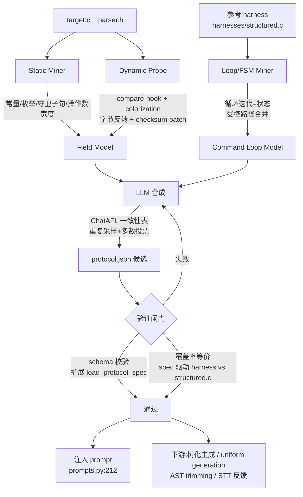

# Protocol Format 自动化构建:方法抽取与落地映射

本文从六组工作中抽取**可复用的方法机制**,并逐一映射到本仓库
`benchmarks/mini_parser/protocol.json` 的各个字段与 `harness_generation/`
的现有模块上,给出从手工编写走向自动抽取的可行路径。

## 0. 问题定位

### 0.1 现状

`protocol.json` 是声明式协议契约,由人工编写,经
`harness_generation/protocol_spec.py` 的 `discover_protocol_spec()` 在同目录
自动发现,由 `load_protocol_spec()` 只做外壳校验(`schema_version` /
`entry_function` / `contract` 类型),`contract` 内部**原样透传**,再由
`candidate.py:135` 挂到 `summary["protocol_contract"]`,最终经
`prompts.py:212` 注入 LLM prompt。

### 0.2 待自动化的对象

`protocol.json` 内部并不是同质的,按可自动化程度分成三块:

| 块 | 内容 | 信息来源 |
|---|---|---|
| **A. 帧格式** | `frame.fields[]`(offset/width/endianness/value) | 可从 `target.c` 静态恢复 |
| **B. 常量约束** | `header_size`、`max_payload`、opcode 枚举范围 | 可从 `parser.h` 静态恢复 |
| **C. 惯用法** | `command_loop`、`context`、`requirements`、`notes` | **不在 `mp_parse` 里**,只能从参考 harness 或 LLM 归纳 |

C 块与 A/B 块的可自动化程度差距是本文的核心结论:**A/B 是工程问题,C 是归纳问题**。
下面的六组工作按此分工对号入座。

---

## 1. 六篇工作的方法抽取

### 1.1 ChatAFL — LLM 做 grammar / state 推理

> Meng, Mirchev, Böhme, Roychoudhury. *Large Language Model guided Protocol
> Fuzzing.* NDSS 2024. <https://github.com/ChatAFLndss/ChatAFL>

**方法机制**

1. **Grammar 抽取**:few-shot prompt 给出 RTSP/HTTP 示例,要求 LLM 以固定
   JSON 模板输出目标协议的全部消息模板,变量位置替换为 `<<VALUE>>` 占位符,
   例如 `PLAY: ["PLAY <<VALUE>>\r\n", "CSeq: <<VALUE>>\r\n", ...]`。
   `temperature=0.5`。
2. **一致性表(consistency table)** —— 真正值得抄的部分。同一抽取任务**重复
   生成 3–5 轮**,逐字段统计频次,**保留多数轮次都出现的字段**以滤除幻觉。
   这是把 LLM 抽取从"不可复现"变成"可复现"的关键工程手段。
3. 产出的 grammar 转成 PCRE2 正则,供结构化变异使用。
4. **Seed 增补**:让 LLM 把缺失的消息类型插入已有 seed 序列。
5. **覆盖平台期处理**:把近期通信历史喂给 LLM,要求生成能到达新状态的消息。

**结果**:RTSP 十种消息类型中 9 种与 RFC 2326 一致(仅偶尔漏掉可选的 `Range`);
相对 AFLNet / NSFuzz 状态转移多 47.6% / 42.7%,状态数多 29.6% / 25.8%,
代码覆盖多 5.8% / 6.7%;发现 9 个未知漏洞。

**对本框架的可迁移点**

- **一致性表直接适用于 C 块生成**。`command_loop`、`context.lifetime`、
  `requirements`、`notes` 这段散文没有确定答案,但重复采样 + 逐字段投票能压掉
  LLM 的自由发挥,产出稳定的候选。
- ChatAFL 的 `<<VALUE>>` 占位符语义,与本仓库 `fields[].value` 中
  `"fuzzer-controlled bytes"` 这类描述是同一回事 —— 即"此字段由 fuzzer 控制,
  格式由契约固定"。可直接对齐表示法。
- **需要注意的方法错配**:ChatAFL 的输入是**自然语言 RFC**,我们的输入是
  **源码**。所以 ChatAFL 贡献的是 LLM 的**可靠性工程**(投票、重试、占位符
  模板),不是抽取源。抽取源要走 §1.3 / §1.4。

---

### 1.2 REDQUEEN — magic / checksum 的测量原语

> Aschermann, Schumilo, Blazytko, Gawlik, Holz. *REDQUEEN: Fuzzing with
> Input-to-State Correspondence.* **NDSS 2019**(非 USENIX)。

**方法机制**

1. **input-to-state correspondence**:输入中的一部分常以近乎未修改的形式
   出现在程序状态里。REDQUEEN 不实现完整污点分析,而是**挂钩比较指令**
   (以及函数调用参数),近似地恢复这种对应关系。
2. **比较指令 → 变异模式**:当发现两个不同操作数被比较,提取为
   `<pattern → repl>` 模式,配合 ±1 变体与多种编码(零/符号扩展、**字节反转**、
   ASCII 等)应用到输入上。
3. **Colorization**:向输入注入随机字节以提高熵,从而**缩小候选替换位置的范围**
   —— 这是让比较指令定位变精确的关键技巧。
4. **Checksum 的 patch + verify 闭环**:用启发式识别"校验和式比较",**patch 掉**
   (例如把比较改成 `cmp al, al` 恒真),在此状态下 fuzz 找到能到达深层逻辑的
   输入,再**回到未 patch 的程序验证** input-to-state 变异能否在真实校验下
   通过。嵌套校验用依赖图 + 拓扑排序处理。

**结果**:LAVA-M 上首个超过 100% 的工具(2265 个标注 bug 只漏 2 个,另找出
335 个未标注 bug),65 个新 bug / 16 个 CVE,对 VUZZER、KLEE、AFLFast、
LAF-INTEL 最高快三个数量级。

**对本框架的可迁移点** —— 这组原语是把 §0.2 的 A 块从"猜"变成"测"的仪器:

- **Colorization 恢复 magic 与其 offset**。向 payload 注入随机字节,观察哪些
  字节被拿去和常量比较 —— 直接给出 `magic0='M'` @0、`magic1='P'` @1、
  `version=1` @2 及 `mp_parse` 中 `return -2` 的这三个常量。
- **字节反转探针恢复 endianness**。REDQUEEN 的编码变体里包含字节反转;
  若反转形式命中比较,则该字段为小端。这是一个**可执行的 endianness 判定器**,
  可直接用于确认 `payload_length`(@4)与 `checksum`(@6)的 `little_endian`。
- **checksum 的 patch + verify 恢复字段语义类型**。把
  `mp_checksum(data + MP_HEADER_SIZE, len) != le16(data + 6)` 这个比较
  patch 成恒真后,若 opcode 分支覆盖显著上升,即可**证明**该字段是校验和,
  且其覆盖范围是 payload 区(`data + MP_HEADER_SIZE`,长 `len`)。
  这是 `checksum` 字段 `value` 描述从自然语言变成可验证事实的途径。
- **操作数宽度给出字段 width**。比较/加载指令的操作数宽度直接对应字段宽度
  (见 §1.4 Tupni 的 chunk 分段)。

**局限**:REDQUEEN 本身是 fuzzer 而非规范挖掘器,不产出声明式 spec;
它提供的是**测量手段**,需要外面套一层把测量结果写成 JSON 的收口逻辑。

---

### 1.3 Controlled Static Loop Analysis — 从 parser 实现静态抽取 FSM

> Shi, Xu, Zhang(Purdue). *Extracting Protocol Format as State Machine via
> Controlled Static Loop Analysis.* **USENIX Security 2023**, pp. 7019–7036.
> arXiv:2305.13483。

**方法机制**

1. **动机**:主流协议格式逆向依赖动态分析,受**低覆盖率**所限 —— 推断出的格式
   只反映观察到的输入里出现过的特征。本文改为**从 parser 实现静态推断**。
2. **目标类别**:格式可由**约束增强的正则表达式**描述、并由 **FSM** 解析的协议。
   这类 FSM 在代码里通常实现为**复杂的解析循环**,常规静态分析难以处理。
3. **核心建模**:**把循环的每一次迭代视为一个状态,把迭代之间的依赖视为状态
   转移**。由此把"解析循环"提升为"状态机",再由状态机反推消息格式。
4. **Controlled(受控)**:目标是路径敏感的高精度,但逐路径展开会**路径爆炸**,
   因此按精心设计的规则**尽可能合并路径**。论文明确对比了循环展开、循环不变式、
   以及既有 FSM 推断工作(如 Chen 等、Shimizu 等、Proteus)在此处的
   状态/路径爆炸或假设不现实的问题。
5. **输出**:状态机 + 消息格式;推断耗时约 5 分钟,精度与召回均 >90%;
   把状态机回灌给协议 fuzzer 后覆盖率提升 **20%–230%**,额外发现 **10 个零日**。

**对本框架的可迁移点**

- **这是 §0.2 中 C 块"`command_loop`"的对口方法**。但要注意一个位置错配:
  `mp_parse` 内部**没有**解析循环 —— 它的 `switch (data[3])` 是单次分派。
  真正的循环在 harness 里:

  ```c
  for (unsigned step = 0; step < 32 && Size - pos >= 2; ++step)
  ```

  所以"循环迭代 = 状态"要应用在**参考 harness 的循环**上,而不是 `mp_parse`
  上。这正好解释了为什么 `command_loop.max_steps: 32` 与
  `selector` 语义在 `target.c` 里找不到 —— 它们是 harness 的状态机。
- **`MP_NESTED_LENGTH` 分支是真正常规意义下的解析循环**:
  `target.c:116` 的 `size_t inner_len = le16(p);` 处于一个嵌套解析循环中。
  这正是该文针对的"约束增强正则 + FSM 实现为解析循环"形态,是 `notes` 里
  "嵌套 payload 字段"描述的来源。
- **"受控合并"是可行性的关键**:如果直接对 `{M,P,1,op,...}` 这种带长度前缀的
  帧做路径敏感展开,长度域会立刻导致爆炸;必须先用 §1.4 的约束把它固定成一个
  符号区间才能收敛。

---

### 1.4 Polyglot / Tupni — 传统 RE 的字段模型与约束推断

> Caballero, Yin, Liang, Song. *Polyglot: Automatic Extraction of Protocol
> Message Format using Dynamic Binary Analysis.* **CCS 2007**, pp. 317–329.
>
> Cui, Peinado, Chen, Wang, Irún-Briz. *Tupni: Automatic Reverse Engineering of
> Input Formats.* **CCS 2008**, pp. 391–402.

这两篇给出的是**字段模型(元数据词汇表)**和**约束推断**,是六组工作里与
`protocol.json` 的 `frame.fields[]` 结构最直接对应的一组。

#### Polyglot:shadowing 与方向字段

1. **shadowing 范式**:核心洞察是"**协议实现处理收到的数据的方式,揭示了消息
   格式**"。因此在模拟器(QEMU)中运行二进制、对接收数据打**动态污点标记**,
   监视其被如何使用,再从事中提取格式 —— 不依赖网络流量聚类(那样缺少语义)。
   可在**去符号的二进制**上工作,一次处理一条消息。
2. **字段属性模型**:field start / field length(定长或变长)/ field boundary
   (**Fixed / Direction / Separator**)/ field type(Direction / Non-Direction)/
   field keywords。
3. **Direction field(方向字段)**:即存有"另一个字段位置信息"的字段,分三类 ——
   **length 字段**(编码目标字段长度)、**pointer 字段**(编码相对位移)、
   **counter 字段**(编码在列表中的位置)。检测方式:该字段被用于推进指针。
   - 直接法:存在间接访存,(1)访问被污点的内存位置,(2)目的地址由污点数据算出。
   - 间接法:指针推进发生在循环中 —— 识别 trace 中的循环(重复代码段 + 回跳),
     其中**停机条件被污点**者标记为污点。
4. **关键:对 direction field 的编码不做任何假设**(字节数、整数编码等),
   这正优于假设固定长度编码的既有工作。
5. **separator 的发现也不假设其值**(不像既有工作假设空白/制表符)。
6. **定长字段边界**:依据"程序把哪些输入字节作为一个语义单元使用"来分组,
   从而找到**相邻二进制字段之间**的边界。
7. **keyword 提取**:可从**单条消息**中提取协议常量,不需要同一位置的重复
   出现。

**结果**:11 个真实实现、5 种协议(DNS、HTTP、IRC、Samba、ICQ),与 Wireshark
手工编写的格式对比,差异很小。

#### Tupni:字段分段、记录序列与跨字段约束

1. **字段边界**:把输入切成 **chunk** —— CPU 指令操作数中**最长的连续被污点
   字节序列**(忽略 move 指令)。可识别 8/16/32/64 位整数操作数、浮点 chunk、
   以及**大端反转字节**,粒度到字节。
2. **记录序列**:通过分析程序中的**循环**识别任意记录序列(循环处理无界记录
   序列),BNF 形式为 `(R1|R2|…|Rn)*`。
3. **记录类型**:按"处理该记录的指令集合"对记录聚类成少数几类。
4. **约束(constraints)** —— 最重要的一项:由动态数据流分析跟踪符号谓词,推断
   字段值约束与跨字段/跨消息依赖。论文明确列举的形状包括:
   - **length 字段**(某字段指定数组字段的长度)
   - **checksum 字段**(其值依赖其他、可能是全部字段的值)
   - **常量值**(某些字段被强制要求的 magic number)
5. **匹配与合并**:来自不同 trace 的两个基字段若被同一组指令访问则匹配;
   记录序列若由同一循环(唯一入口点)处理则匹配;记录若指令集相同则同类型。
   跨 trace 合并 BNF 规则,**为不匹配的字段/记录生成选择(alternation)规则**,
   从而对多个输入做**泛化**。
6. **局限**:字节级污点在字段边界与字节边界不重合时表现差;压缩图像文件只能
   逆向出容器格式。

**结果**:10 种格式(5 文件格式 + 5 网络协议),最多 5 分钟;原型 14,000 行
C++ + 4,100 行 Perl。

#### 对本框架的可迁移点

- **Tupni 的约束分类与 `mini_parser` 的帧几乎 1:1 对应**:

  | Tupni 约束形状 | `protocol.json` 中的对应 |
  |---|---|
  | length 字段 | `payload_length`(且约束为 `len == size - MP_HEADER_SIZE`) |
  | checksum 字段 | `checksum`(`mp_checksum(payload, payload_length)`) |
  | 常量值 magic number | `magic0='M'`、`magic1='P'`、`version=1` |
  | `(R1|…|Rn)*` 记录序列 | `command_loop` |

  **这是"该任务可自动化"的最强论据**:Tupni 在 2008 年就**自动推断**出了这四类
  形状,而我们的 `protocol.json` 恰好只包含这四类。
- **chunk 分段给出 width**:`le16(data + 4)` 是一次 16 位加载,其操作数宽度
  直接给出 `width: 2`;`data[3]` 是 8 位,给出 `width: 1`。
- **Polyglot 的"不假设编码"正是我们需要的**:`le16` 是**两字节小端**,
  若沿用假设固定编码的旧方法会错。其"方向字段用点推进指针来检测"的思路,
  映射到源码层面就是"**该字段被用于计算另一个字段的访问范围**" —— 在
  `mp_parse` 里即 `len` 被用于 `malloc(len)`、`memcpy(p, data + MP_HEADER_SIZE, len)`
  和 `mp_checksum(data + MP_HEADER_SIZE, len)`,是干净的 length 字段签名。
- **Tupni 跨 trace 匹配/合并 → alternation 规则**,对应本框架应支持
  `fields[].value` 的**多候选**表示(例如 `magic` 若在不同版本间变化)。
  当前 `protocol.json` 的 schema 只有单值,建议扩展。
- **重要限制**:Polyglot / Tupni 都依赖重量级动态二进制插桩(QEMU / iDNA)。
  **对本框架不必照搬** —— 我们有源码,`le16(data+4)` 的操作数宽度可由
  tree-sitter **静态**读出(现有 `_body_facts` 已在收集
  `subscript_expressions` 与 `called_functions`)。**采纳其字段模型与约束分类,
  但用静态分析近似其分析过程**,是成本最低的路线。

---

### 1.5 StateAFL / SGFuzz — stateful context 与状态反馈

> Natella. *StateAFL: Greybox fuzzing for stateful network servers.*
> **Empirical Software Engineering** 27(191), 2022(arXiv:2110.06253)。
>
> Ba, Böhme, Mirzamomen, Roychoudhury. *Stateful Greybox Fuzzing.*
> **USENIX Security 2022**, pp. 3255–3272(arXiv:2204.02545)。

这一组是 §0.2 中 C 块 **`context` 与 stateful 语义**的对口方法。

#### StateAFL

1. **编译期插桩**:在**内存分配**与**网络 I/O** 操作上插桩。
2. **运行期状态推断**:每次请求–应答交换时,**快照长生命周期内存区域**
   (生命周期跨越整个 session 的数据,如认证状态、工作目录),**丢弃短生命周期
   数据**。
3. **模糊哈希**:用局部敏感哈希(TLSH 库 + MVPTree 近邻检索)把内存内容映射为
   **唯一状态标识**。
4. **增量构建协议状态机**并据此指导 fuzzing。无需任何协议定制。
5. **结论性发现**:从内存推断的状态比**仅用响应码**更能反映服务器行为
   (响应码会误导并产生冗余状态)。

结果:ProFuzzBench 13 个服务器,无需定制即达到或超过定制化 fuzzing。

#### SGFuzz(Stateful Greybox Fuzzing)

1. **关键观察**:协议实现中的状态变量通常用**具名常量**表示,最常见是
   **enum 类型**或 `#define` 宏。对 **Top-50 最广泛使用的开源协议实现**的调查
   显示:**每一个**实现都用具名常量表示状态;**44/50** 用枚举,**6/50** 用
   `#define`;跨 16 种协议成立。
2. **自动识别**:用**正则模式匹配**自动识别"被赋予具名常量的变量",无需手工
   标注;评测中 **>99%** 的抽取变量是真实状态变量(假阳性主要是配置变量或
   错误/响应码,它们通常不作为"稀有"状态出现)。
3. **State Transition Tree(STT)**:在**每一个状态变量赋值点**注入调用,运行期
   高效构建 STT —— 记录所有 fuzzer 生成输入序列上状态变量的取值序列,作为
   探索过的状态空间的轻量抽象(与 fuzzer 全局共享),用于引导输入生成。
4. **三条启发式**:
   - 把**触发 STT 新节点**的输入加入种子语料(不只按代码覆盖)。
   - 对遍历**稀有 STT 节点**的种子、或其后代更可能走不同 STT 路径的种子
     **加大能量分配**(核心逻辑状态序列 vs 错误处理序列)。
   - **关联输入字节与状态转移**,对"变异后能触发新 STT 节点"的字节给更多
     变异机会。

结果:状态序列覆盖比 LibFuzzer 多 33×、比 IJON 多 15×、比 AFLNet 多 260×;
相同分支覆盖快 2× 以上;12 个未知 bug、8 个 CVE,其中 10/12 是 stateful bug。

**对本框架的可迁移点** —— 这组直接决定 `contract.context` 与 `notes`:

- **`context.lifetime` 有机械判据**。StateAFL 的"长生命周期区域 vs 短生命周期
  数据"给出的正是这个判据:`mp_init`/`mp_destroy` 包围了命令行循环,说明
  上下文的生命周期**跨越循环但不跨越 iteration**。通过对 `mp_init` /
  `mp_destroy` 插桩可**自动判定**该字段,而不是靠人写散文。这与当前
  `protocol.json` 中
  `"one context per libFuzzer iteration, initialized before the command loop and destroyed after the loop"`
  完全对应。
- **`mp_context` 的 stateful 字段可由 SGFuzz 规则推广得到**。`mp_context` 的
  `saved` / `saved_len` / `owns_saved` 并非直接赋具名常量,但它们的赋值点
  **由 `MP_STORE` / `MP_RELEASE` / `MP_USE` 这些枚举值分支守卫**。把 SGFuzz 的
  规则从"被赋予具名常量的变量"推广为"**赋值点被互异具名常量守卫的变量**",
  即可自动导出 `protocol.json` 中
  `"Stateful opcodes MP_STORE, MP_RELEASE and MP_USE need a context that lives across multiple frames in one fuzz input."`
- **`observation` 字段是天然的状态观测点**。`mp_context` 里有
  `volatile uint32_t observation`,参考 harness 每帧后读一次。这正是
  StateAFL"快照 → 状态 ID"的低成本替身:对 `ctx` 每帧做快照即可得到可观测
  状态集,用来**生成 `notes` 中的 stateful 描述**,也可作为覆盖率之外的第二
  反馈信号。
- **SGFuzz 的第三条启发式可直接实现**:`structured.c` 目前对 opcode 的选择是
  `Data[pos++] % 7`,字节与状态转移之间没有关联。按 SGFuzz 的做法关联
  "哪些字节触发新 STT 节点",即可把 `selector` 描述从
  `"consume one fuzzer byte per step and map it to opcode range 1..7"`
  升级为带能量分配的策略。

---

### 1.6 NAUTILUS / Superion — 结构化输入模型 × coverage feedback

> Aschermann, Frassetto, Holz, Jauernig, Sadeghi, Teuchert. *NAUTILUS: Fishing
> for Deep Bugs with Grammars.* **NDSS 2019**。
>
> Wang, Wu, Xu, Wei, Zhang, et al. *Superion: Grammar-Aware Greybox Fuzzing.*
> **ICSE 2019**(arXiv:1812.01197)。

这一组是流水线的**消费端**:给定 `protocol.json` 之后如何把它用出价值。

#### NAUTILUS

1. 定位:**首个把语法生成与覆盖率反馈结合**的 fuzzer。纯变异 fuzzer 难以通过
   结构化输入的语法与语义检查;语法 fuzzer 能过语法但不看覆盖率。
2. **推导树(derivation tree)**作为内部表示,在树上做结构变异后再 unparse 成
   真实输入。
3. **支持用 Python 脚本扩展 CFG** 以处理非上下文无关结构(如 XML 开闭标签
   配对)。
4. **生成策略**:naive generation(随机选规则,带去重过滤)与
   **uniform generation(对所有可能性均匀采样,避免语法结构性偏好)**。
5. **最小化**:subtree minimization(把节点替换为最小子树,若仍能触发新路径)
   与 recursive minimization(其后进一步降低递归深度)。
6. 四种树变异策略 + 复用 AFL 的字节级变异。

结果:mruby 7、PHP 3、ChakraCore 2、Lua 1;覆盖率相对 AFL 高一个数量级,
相对既有语法 fuzzer 高两倍以上。

#### Superion

1. 动机:AFL 的 **trimming 与变异是语法盲的**,面对 XML/JavaScript 这类结构化
   输入时,绝大多数生成输入在早期语法解析阶段就被拒绝。
2. **语法感知的 trimming**:用解析后 AST 在**树层面**裁剪。
3. **两种语法感知变异**:增强的字典变异;**树变异** —— 用 AST 做**子树替换**,
   子树可来自目标输入自身,也可来自队列中随机选取的另一样本。
4. 解析能力由 **ANTLR4 C++ runtime** 提供。在 AFL 上扩展 3,372 行 C/C++。
5. 对比:jsfunfuzz 一个 bug 都没找到,原因正是**手工编写语法不现实**。

结果:相对 AFL 行覆盖 +16.7%、函数覆盖 +8.8%;30 个新 bug、16 个 CVE。

**对本框架的可迁移点** —— 这是"为什么要自动生成 `protocol.json`"的答案:

- **`protocol.json` 本身就是一份语法**。`frame` = 定长头 + 变长 payload,
  带字段约束;`command_loop` = `(frame)*`,上限 32。NAUTILUS/Superion 告诉
  我们拿到这份语法后该做什么:
  1. 把输入表示成**树**(命令序列 → 帧 → 头字段 + payload),而不是裸字节。
  2. 在树上做**结构变异**(子树替换),而非字节翻转。
  3. **uniform generation** 消除模偏差。
  4. **subtree minimization** 得到保持覆盖的规范种子集。
  5. **AST 级 trimming** —— AFL 默认 trimming 会破坏帧结构。
- **一个可直接验证的缺陷**:`structured.c:16` 的 opcode 选择是

  ```c
  uint8_t op = (uint8_t)(1u + (Data[pos++] % 7u));
  ```

  `256 % 7 = 4`,因此 opcode 1–4 各被命中 37 次、opcode 5–7 各 36 次
  (共 256)。NAUTILUS 的 uniform generation 批评的正是这类结构性偏好。
  虽然偏差很小,但这是"用语法模型替代取模"的一个具体、可测的收益点。
- **`selector` 与 `payload_length_source` 目前都是裸字节消费**。改为树表示后,
  这两个字段可升级为"语法驱动的选择",同时保持与覆盖率反馈的对接 ——
  即本仓库 `target_coverage.py` 已有的反馈通道。

---

## 2. 映射:每个 `protocol.json` 字段由谁负责

| `protocol.json` 元素 | 方法来源 | 具体手段 | 块 |
|---|---|---|---|
| `entry_function` | — | tree-sitter 符号表(已有 `_collect_functions`) | B |
| `frame.header_size` | Polyglot / Tupni | 常量 + 守卫子句 `size < MP_HEADER_SIZE` | B |
| `frame.max_payload` | Tupni | 枚举常量 + 守卫 `len > MP_MAX_PAYLOAD` | B |
| `opcode` 范围 `1..7` | Tupni + REDQUEEN | 枚举成员计数 + `switch(data[3])` 的 case 集合 | B |
| `fields[].offset` | Polyglot / Tupni | 下标表达式 `data[i]` / `le16(data + k)` | A |
| `fields[].width` | Tupni(chunk 分段) | 操作数宽度:`data[3]`→1、`le16`→2 | A |
| `fields[].endianness` | REDQUEEN | 字节反转探针是否命中比较 | A |
| `fields[].value`(magic/version) | REDQUEEN | compare-hook + colorization 定位常量与位置 | A |
| `fields[].value`(fuzzer 控制) | 静态 | 该位置不被任何常量比较触及 | A |
| `payload_length` 的语义类型 | Polyglot(direction field / length) + Tupni(length 约束) | 被用于计算另一字段的访问范围 | A |
| `checksum` 的语义类型 | REDQUEEN(patch+verify) + Tupni(checksum 约束) | patch 掉该校验后深层覆盖是否上升 | A |
| `command_loop` | **§1.3 Controlled Static Loop Analysis** | 循环迭代=状态,迭代依赖=转移;对**参考 harness 的循环**施加 | C |
| `context.init/destroy/lifetime` | StateAFL | 长生命周期区域 + malloc/free 包围分析 | C |
| stateful opcode 描述 | SGFuzz | "赋值点被互异具名常量守卫的变量" | C |
| `requirements` / `notes` 散文 | ChatAFL | 重复生成 + 逐字段多数投票(一致性表) | C |
| 下游如何使用 | NAUTILUS / Superion | 树化表示、uniform generation、AST 级 trimming | — |

---

## 3. 综合流水线



各段与方法的对应:

- **Static Miner(§1.4 的静态近似)**:复用 `source_analysis.py` 的
  `_collect_enumerators` / `_collect_types` 取 B 块常量;复用 `_body_facts`
  的 `if_conditions` / `subscript_expressions` / `called_functions` 取 A 块的
  offset、width、守卫常量。**不需要 QEMU/iDNA 级插桩**。
- **Dynamic Probe(§1.2)**:实现 REDQUEEN 的三个原语(compare-hook、
  colorization、checksum patch+verify),复用 `target_coverage.py` 取覆盖变化。
- **Loop/FSM Miner(§1.3)**:对 `structured.c` 的 `for (step < 32)` 施加
  "迭代=状态"建模,产出 `command_loop`;对 `target.c:116` 的嵌套解析循环
  产出嵌套 payload 描述。
- **LLM 合成(§1.1)**:只负责 C 块的散文部分。输入是 A/B 块的结构化事实 +
  §1.5 的状态观测,输出受 JSON Schema 约束,N 次采样后逐字段投票。
- **验证闸门**:当前 `load_protocol_spec` 只做外壳校验(`contract` 是
  `dict(contract)` 浅拷贝透传)。需扩展为真正校验 `contract.frame.fields`,
  并增加"spec 驱动的通用 harness 覆盖率 ≈ `structured.c` 覆盖率"的等价断言。

---

## 4. 关键发现与风险

### 4.1 三个已确认的具体问题

1. **`source_analysis.py:493-496` 是硬编码**,位于通用分析模块中:

   ```python
   if "mp_init" in helper_names and "mp_destroy" in helper_names:
       hints.append("mp_init/mp_destroy are available helpers for mp_context lifetime management")
   if "mp_checksum" in helper_names:
       hints.append("mp_checksum is available as a helper for constructing parser inputs")
   ```

   若本工作的主张是通用流水线,这是可被直接指出的问题。建议按签名/调用图
   泛化(成对出现的 init/destroy;被 entry 守卫子句调用的纯函数)。

2. **`structured.c:16` 的取模偏差**(见 §1.6)。

3. **纯 trace 方法会低估字段宽度 —— 这是必须走混合路线的硬证据**。
   `payload_length` 宽 2 字节(`le16`,小端),但参考 harness 里
   `len ≤ MP_MAX_PAYLOAD = 64`,于是 `frame[5] = (uint8_t)(len >> 8)`
   **恒为 0**。一个只观察合法行为的 Polyglot/Tupni 式动态挖掘器会得出
   "该字段宽 1 字节"的结论;只有读 `mp_parse` 的 `le16(data + 4)` 才能得到
   正确的 width。**字段宽度来自 parse 代码,不来自行为轨迹** —— 这条同时
   解释了为什么 §1.3 的静态方法和 §1.2 的动态方法不能互相替代。

### 4.2 循环论证风险

当前体例是:人工编写的 `protocol.json` 作为 ground truth 喂给 LLM,用于
**测量** LLM 生成 harness 的能力。若改为 LLM 自动挖掘 spec 再喂给 LLM,
测量对象就变成 LLM 的自洽性,基准失效。

**建议定位**:保留人工 spec 作为 ground truth,把 miner 作为**被评估对象** ——
即"自动协议契约挖掘准确率"的基准,`protocol.json` 作标注。这比"让流水线更
自动"更站得住,且标注数据与 `discover_protocol_spec` 的发现机制都已具备。

### 4.3 文献的共同限制

| 方法 | 限制 | 对本框架的影响 |
|---|---|---|
| Polyglot / Tupni | 依赖 QEMU / iDNA 级动态二进制插桩;字节粒度,字段边界与字节边界不重合时失效 | 不建议照搬实现,采纳其**字段模型与约束分类**,用静态分析近似 |
| Controlled Static Loop Analysis | 仅适用于"约束增强正则 + FSM 实现为解析循环"这一类协议 | 本目标的 `command_loop` 恰好属于该类,但需先固定长度约束才能收敛 |
| REDQUEEN | 输入不映射到变换后状态时失效(如哈希表索引);本身不产出声明式 spec | 作为**测量原语**使用,需外套收口逻辑 |
| ChatAFL | 输入是自然语言规范,非源码;依赖 LLM API 与速率限制 | 只迁移其**可靠性工程**(投票/重试/占位符模板) |
| StateAFL / SGFuzz | 面向网络服务器与消息序列;状态变量假设为具名常量 | `mp_context` 需把规则推广为"赋值点被互异具名常量守卫" |
| NAUTILUS / Superion | 需要**用户提供语法**;NAUTILUS 对二进制格式需额外扩展 | 语法正是我们要自动生成的产物 —— 二者互补,不冲突 |

---

## 5. 实施顺序与状态

| # | 步骤 | 状态 |
|---|---|---|
| 1 | **A/B 静态 miner**(tree-sitter,复用 `source_analysis`) | **已实现**:`harness_generation/protocol_miner.py` |
| 2 | 动态探针(REDQUEEN 三原语),判定语义类型与 endianness 的交叉验证 | 待办 |
| 3 | §1.3 循环建模,针对 `structured.c` 的循环产出 `command_loop` | 待办 |
| 4 | 验证闸门(扩展 `load_protocol_spec` + 覆盖率等价) | 待办,须先于第 5 步 |
| 5 | LLM 合成 + 一致性表,只用于 C 块散文 | 待办 |

### 5.1 已实现的 A/B miner

`harness_generation.protocol_miner` 按本文 §0.2 的划分只覆盖 A/B 两块,
并强制每条事实携带源码证据:

- `mine_protocol_facts(source, function)` → `ProtocolFacts`
- `ProtocolFacts.to_contract(strict=True)` → `protocol.json` 形状的契约;
  任一字段缺证据即抛 `ProtocolMinerError`
- `limitations` 显式列出静态分析**无法**决定的内容(含"惯例块不在 parser 体内")
- CLI:`python -m harness_generation.protocol_miner --source ... --function ...`

**对 `mini_parser` 的实测结果**(`tests/test_protocol_miner.py`,21 项):

| offset | 人工 `protocol.json` | miner 恢复 | width | endianness | role |
|---|---|---|---|---|---|
| 0 | magic0 | magic0 | 1 | — | magic |
| 1 | magic1 | magic1 | 1 | — | magic |
| 2 | version | version | 1 | — | version |
| 3 | opcode | opcode | 1 | — | opcode |
| 4 | payload_length | payload_length | 2 | little_endian | payload_length |
| 6 | checksum | checksum | 2 | little_endian | checksum |
| 8 | payload | payload | var | — | payload |

`header_size` 8 = 8;`max_payload` 人工写的符号 `MP_MAX_PAYLOAD` 被解析为 64;
opcode 范围 1..7 且枚举名全部还原。**7/7 字段、offset、width、endianness、
role 全部一致。**

关键测试是
`test_every_field_evidence_points_at_real_source_lines`:它重新读取源文件,
断言每条 evidence 的 `snippet` 真的出现在它声称的那一行上 —— 否则"每字段有
证据"只是注释而不是保证。另有
`DifferentialAgainstHandWrittenContractTests` 以人工 spec 为 ground truth
做差分,即 §4.2 建议的"把 miner 当被评估对象"的落点。

**已知未覆盖**(留给第 2 步):miner 从**源码**推断 endianness 与语义类型,
尚未用 REDQUEEN 的运行期探针交叉验证。§4.1 第 3 条指出的"纯轨迹会低估字段
宽度"正是反向的;两者应当互为校验。

---

## 6. 参考

| 工作 | 出处 | 链接 |
|---|---|---|
| ChatAFL | NDSS 2024 | <https://www.ndss-symposium.org/ndss-paper/large-language-model-guided-protocol-Fuzzing/> · <https://github.com/ChatAFLndss/ChatAFL> |
| REDQUEEN | NDSS 2019 | <https://dev.ndss-symposium.org/wp-content/uploads/2019/02/ndss2019_04A-2_Aschermann_paper.pdf> |
| Extracting Protocol Format as State Machine via Controlled Static Loop Analysis | USENIX Security 2023, pp. 7019–7036 | arXiv:2305.13483 |
| Polyglot | CCS 2007, pp. 317–329 | <https://dl.acm.org/doi/abs/10.1145/1315245.1315286> |
| Tupni | CCS 2008, pp. 391–402 | <https://dl.acm.org/doi/10.1145/1455770.1455820> |
| StateAFL | Empirical Software Engineering 27(191), 2022 | arXiv:2110.06253 |
| Stateful Greybox Fuzzing(SGFuzz) | USENIX Security 2022, pp. 3255–3272 | <https://www.usenix.org/conference/usenixsecurity22/presentation/ba> |
| NAUTILUS | NDSS 2019 | <https://www.ndss-symposium.org/ndss-paper/nautilus-fishing-for-deep-bugs-with-grammars/> |
| Superion | ICSE 2019 | arXiv:1812.01197 |

**venue 更正说明**:REDQUEEN 发表于 NDSS 2019(非 USENIX);StateAFL 发表于
*Empirical Software Engineering* 2022(非 NDSS),NDSS 2022 无此文。
